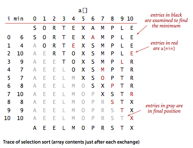

## 2-1-ElementarySots 基础排序

#### Insertion  插入排序
核心代码： 比较i 和 j>i 的数, 如果[j] 小于 [j-1] 就立马交换其值, 过程如下


```
    public static void sort(Comparable[] a) {
        int N = a.length;
        for (int i = 0; i < N; i++) {
            for (int j = i; j > 0 && less(a[j], a[j-1]); j--) {
                exch(a, j, j -1);
            }
        }
    }
```

#### Selection  选择排序
核心思想： 比较 i 和 j>i的数, 获取小于i并且是小于中最小的值，然后交换数据


```
    public static void sort(Comparable[] a) {
        int N = a.length;

        for (int i = 0; i < N; i++) {
            int min = i;
            for (int j = i; j < N; j++) {
                if (less(a[j], a[min]))
                    min = j;            // 这里和其他 冒泡不一样 , 选择比a[i] 最小的a[min]
            }
            exch(a, i, min);
        }
    }
```
#### Shell 希尔排序
核心思想:  


## 2-2-Mergesort 并归排序

## 2-3-Quicksort 快速排序

## 2-4-PriorityQueues 优先队列
 
 [二叉堆](https://zh.wikipedia.org/wiki/%E5%A0%86_(%E6%95%B0%E6%8D%AE%E7%BB%93%E6%9E%84)) 简称 堆, , 令其数组的索引在树上移动, a[k] 向上一层 就令 k 等于 k/2, 向一下层则令 k 等于 2k 和 2k + 1;<br/>
 1 ``定义: 当一颗二叉树的每个节点都大于等于他的两个子节点时，称为有序堆``
 2 二叉堆 是一组能够用堆有序的完全二叉树排序的元素，并在数组中按照层级存储 ``(不使用数组的第一个位置 )``
 
 ## 堆排序
 
 
 


